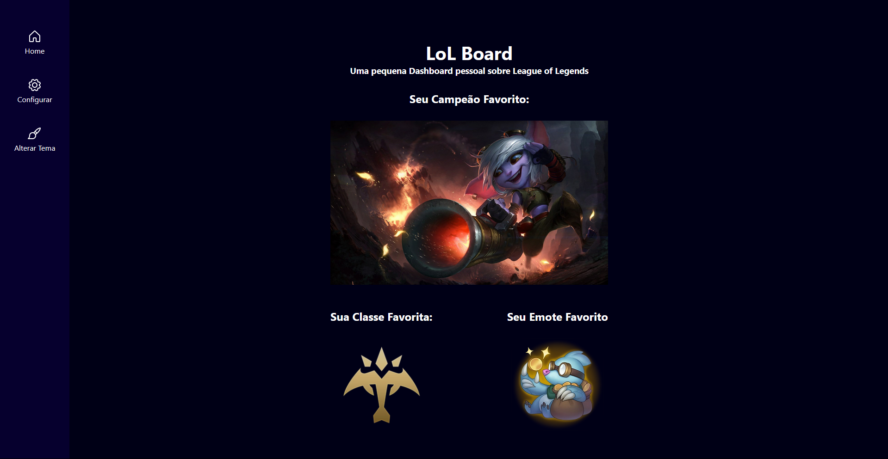

<h1 align="center"> LoL Board </h1>

<p align="center">
  Uma pequena aplicação de dashboard sobre League of Legends.<br/>
</p>

<p align="center">
  <a href="#-tecnologias">Tecnologias</a>&nbsp;&nbsp;&nbsp;|&nbsp;&nbsp;&nbsp;
    <a href="#-instalacao-do-projeto">Instalação do projeto</a>&nbsp;&nbsp;&nbsp;|&nbsp;&nbsp;&nbsp;
  <a href="#-sobre-o-projeto">Sobre o Projeto</a>&nbsp;&nbsp;&nbsp;
</p>

<p align="center">
  
</p>

<p align="center">
  <a href="https://lol-board.vercel.app/" target="_blank">➡️ Acesse o deploy!</a>
</p>

## 🚀 Tecnologias

Esse projeto foi desenvolvido com as seguintes tecnologias:

- React
- Typescript
- Styled Components
- Context API

## ⚙️ Instalação do projeto

Passo-a-passo:

1. Comandos necessários para executar:

```
npm i
npm start
```

> Particularidades do projeto. Dependência externa.

## 💻 Sobre o Projeto

O projeto é uma aplicação inpirada no formato dashboard, onde em uma página home são renderizadas informações previamente processadas e tratadas em outra página. neste caso, o usuário tem algumas escolhas de exibição na página de configuração, e então, suas escolhas são renderizadas na página Home

## 📝TO-DO

O projeto tem agumas pendencias a ser resolvidas (known issues) e tabmém features a serem implantadas:

### Features a serem implantadas:

- Implementação da funcionalidade de trocar temas da página, a partir da página "Alterar Tema"

#### Known Issues: 

- Alguns quesitos de estilização como por exemplo uma melhor visibilidade no elemento selecionado pelo usuário